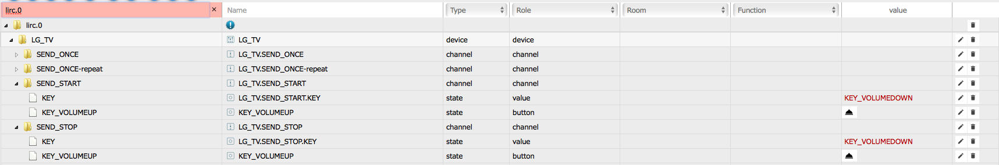
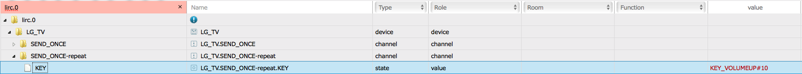

# iobroker.lirc Anleitung

## Einleitung

Dieser ioBroker-Adapter ermöglicht das Senden und Empfangen von IR-Signalen über lirc.

## Voraussetzungen

Ein remote lirc server mit angelernten Fernbedienungen wird vorausgesetzt.

Um den remote lirc server zu aktivieren muss lircd mit der option -l bzw. --listen gestartet werden.

Dazu nachfolgende Änderung vornehmen.

#####Ältere lirc-Versionen:

sudo nano /etc/lirc/hardware.conf
    
    LIRCD_ARGS="--uinput -l"

Der Standard-Port ist 8765.

#####Neuere lirc-Versionen:
listen-Zeile aktivieren und Port (optional mit IP-Adresse) festlegen.

sudo nano /etc/lirc/lirc_options.conf

    listen  = 8765

Für die Verbindung zum lircd über iobroker setzt der Adapter das node-Modul [lirc-client von hobbyquaker ](https://github.com/hobbyquaker/lirc-client/tree/1.0)in der Version 1.0.0 ein.
Dadurch werden auch ältere node-Versionen unterstützt.
Die ebenfalls vorhandene Version 2 des lirc-clients kann nicht mit diesem iobroker-Adapter verwendet werden.

## Konfiguration

Nachdem eine Instanz des iobroker.lirc-Adapters hinzugefügt wurde, müssen die IP-Adresse des Remote-lirc-Servers und dessen Port in den Einstellungen der Instanz hinterlegt werden.

Die Voreinstellungen sind:

	IP-Adresse: 127.0.0.1
	Port: 8765
	Reconnect-Intervall: 5000 ms

Sobald die Konfiguration gespeichert und der Adapter neugestartet wurde, werden die bekannten Fernbedienungen ausgelesen und entsprechende Objekte angelegt.
Serverseitige Änderungen führen zu entsprechenden Aktualisierungen der Objekte. 

## Bedienung
Für jede Fernbedienung wird ein Device mit verschiedenen Channels erzeugt.
Jede Taste der Fernbedienung wird in den beiden SEND_ONCE-Channels als Status-Objekt angelegt.
In den START- und STOP-Channels können die Objekte manuell als Buttons angelegt und verwendet werden.

Jeder Channel enthält ein Status-Objekt "KEY".
Dieses Objekt kann dafür genutzt werden, um einen beliebigen bekannten Key als Wert zu übergeben Nur über das SEND_ONCE-repeat.KEY-Objekt kann auch eine Wiederholrate angegeben werden (KEY#Anzahl).

Jede Instanz verfügt zudem über ein Status-Objekt "LIST". Hiermit lassen sich die Fernbedienungen vom lircd abfragen (leerer Wert). Die Liste wird dabei in den Status geschrieben.
Wird der Status/Wert auf den Namen einer Fernbedienung gesetzt, erfolgt eine Rückmeldung aller bekannten buttons dieser Fernbedienung.
