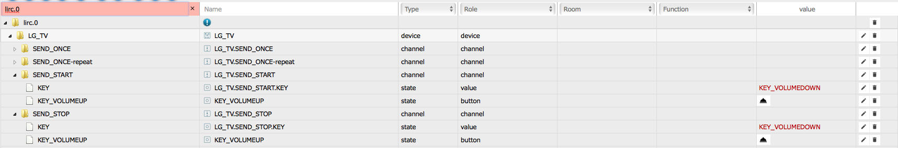
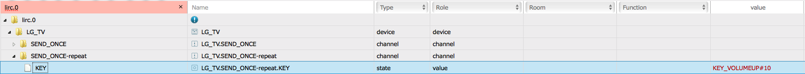

# iobroker.lirc description

## Introduction

This ioBroker adapter allows you to send and receive IR signals via lirc.

## Requirements

A remote lirc server with configured remotes is required.

To activate remote lirc server lircd has to be started with option -l or --listen.

Therefore change following configuration.

#####Older versions of lirc:

sudo nano /etc/lirc/hardware.conf
    
    LIRCD_ARGS="--uinput -l"

Default port is 8765.

#####Newer versions of lirc:
Activate listen and set port (optionally with ip address).

sudo nano /etc/lirc/lirc_options.conf

    listen  = 8765

This adapter uses version 1.0.0 of node-module [lirc-client by hobbyquaker ](https://github.com/hobbyquaker/lirc-client/tree/1.0) for the connection to lirc. This supports also older version of node.
Version 2 of this node-module can't be used with this iobroker adpater.

## Configuration

After adding an instance of iobroker.lirc adapter you need to configure ip address and port of your remote-lirc-server.

Default settings:

	ip adress: 127.0.0.1
	port: 8765
	reconnect interval: 5000 ms

After configuration has been saved and adapter restarted, remotes will be read from lirc-server and according objects will be created.
Changes on server side will cause update of objects accordingly.

## Usage
Every remote will be created as a device.
Each key of a remote will be created as status object in both SEND_ONCE channels.
One can create objects manually as buttons in START and STOP channels.

Each channel has a status "KEY".
This can be used to send any known key by setting it as value. Only at SEND_ONCE-repeat.KEY-Objekt you can also provide count of repeats (KEY#count).

Each instance has an object "LIST". This can be used to request known remotes from lirc server (empty value). List of remotes will be returned into status of "LIST".
If you set status value of this object to name of a remote, status will receive list of all known keys of that remote.